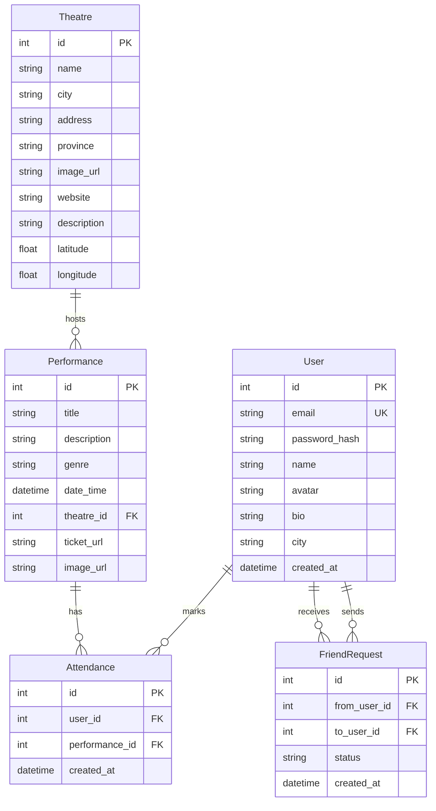

# Podium App — Implementation Plan and Current Status

Last updated: June 5, 2026

Podium is a Dutch social web application for theatre-goers. Users can discover theatre performances across the Netherlands, mark attendance, connect with other users, and see friends' theatre plans.

## Current Status

The MVP is mostly implemented and now builds successfully.

Completed:
- Express API server with route groups for auth, users, theatres, performances, attendance, connections, and feed.
- Local SQL database persisted to `server/podium.db` using `sql.js`.
- Seeded Dutch theatre/performance/demo-user data.
- JWT auth with bcrypt password hashing.
- React + Vite frontend with Dutch UI copy.
- Auth context, API service layer, routing, and responsive header.
- Pages for home, login, signup, theatres, theatre detail, agenda, performance detail, profile, profile edit, feed, user search, and friend requests.
- Frontend production build verified with `npm run build`.
- Local backend health endpoint verified at `http://localhost:3001/api/health`.
- Local frontend verified reachable at `http://localhost:5173`.

Not completed yet:
- Automated backend/API tests.
- Full manual QA pass through every user flow.
- Real theatre-data integration, scraping, or admin panel.
- Notifications.
- Production deployment configuration.
- Prisma schema/migrations; the actual implementation uses direct SQL with `sql.js`.

## Decisions Made

| Area | Original Question | Actual Decision |
|------|-------------------|-----------------|
| Database | PostgreSQL vs SQLite | Lightweight local SQLite-style database via `sql.js` and `server/podium.db` |
| ORM | Prisma planned | Prisma not used; schema and queries are handwritten SQL |
| Data source | Mock data vs API/admin | Seeded mock/sample Dutch theatre and performance data |
| UI language | Dutch vs English | Dutch |
| Connection model | Follow vs friends | Two-way friendship model with friend requests |
| Notifications | Optional | Not implemented in MVP |

## Actual Tech Stack

| Layer | Technology | Purpose |
|-------|------------|---------|
| Frontend | React 19 + Vite | SPA frontend and dev server |
| Routing | React Router 7 | Client-side routing |
| Backend | Node.js + Express 5 | REST API server |
| Database | `sql.js` persisted to `server/podium.db` | Local relational data store |
| Auth | JWT + bcryptjs | Token-based authentication and password hashing |
| Styling | Vanilla CSS | Custom dark theatre-themed design system |
| Icons | Lucide React | UI icon set |

## Actual Project Structure

```text
C:\Code\CodeClan\Podium App\
├── client/
│   ├── public/
│   ├── src/
│   │   ├── assets/
│   │   ├── components/
│   │   │   └── Layout/
│   │   │       ├── Header.jsx
│   │   │       └── Header.css
│   │   ├── context/
│   │   │   └── AuthContext.jsx
│   │   ├── pages/
│   │   │   ├── AgendaPage.jsx
│   │   │   ├── EditProfilePage.jsx
│   │   │   ├── FeedPage.jsx
│   │   │   ├── FriendRequestsPage.jsx
│   │   │   ├── HomePage.jsx
│   │   │   ├── LoginPage.jsx
│   │   │   ├── PerformanceDetailPage.jsx
│   │   │   ├── ProfilePage.jsx
│   │   │   ├── SearchPage.jsx
│   │   │   ├── SignupPage.jsx
│   │   │   ├── TheatreDetailPage.jsx
│   │   │   └── TheatresPage.jsx
│   │   ├── services/
│   │   │   └── api.js
│   │   ├── App.jsx
│   │   ├── index.css
│   │   └── main.jsx
│   ├── index.html
│   ├── package.json
│   └── vite.config.js
│
├── server/
│   ├── src/
│   │   ├── db.js
│   │   ├── index.js
│   │   ├── seed.js
│   │   ├── middleware/
│   │   │   └── auth.js
│   │   └── routes/
│   │       ├── attendance.js
│   │       ├── auth.js
│   │       ├── connections.js
│   │       ├── feed.js
│   │       ├── performances.js
│   │       ├── theatres.js
│   │       └── users.js
│   ├── .env
│   ├── package.json
│   └── podium.db
│
├── implementation_plan.md
└── task.md
```

Notes:
- `server/prisma/` exists but is not used.
- Unused starter Vite files were removed; the app uses `client/src/main.jsx`.

## Database Schema

The schema is created in `server/src/db.js`.



Seeded database contents verified on June 5, 2026:
- 5 demo users
- 15 theatres
- 60 performances
- 15 attendance records
- 4 friend request records

Demo login:

```text
lisa@example.com / welkom123
```

## Implemented API Endpoints

### Auth

| Method | Endpoint | Status | Description |
|--------|----------|--------|-------------|
| POST | `/api/auth/signup` | Done | Register new user |
| POST | `/api/auth/login` | Done | Login and return JWT |
| GET | `/api/auth/me` | Done | Get current user |

### Users

| Method | Endpoint | Status | Description |
|--------|----------|--------|-------------|
| GET | `/api/users/search?q=` | Done | Search users by name/city |
| GET | `/api/users/:id` | Done | Get user profile plus friend/upcoming counts |
| PUT | `/api/users/:id` | Done | Update own profile |
| GET | `/api/users/:id/attending` | Done | Get user's attended performances |

### Theatres

| Method | Endpoint | Status | Description |
|--------|----------|--------|-------------|
| GET | `/api/theatres` | Done | List theatres with city/province/search filters |
| GET | `/api/theatres/:id` | Done | Theatre details with upcoming performances |

### Performances

| Method | Endpoint | Status | Description |
|--------|----------|--------|-------------|
| GET | `/api/performances` | Done | List performances with theatre, genre, date, and search filters |
| GET | `/api/performances/genres` | Done | List distinct genres |
| GET | `/api/performances/:id` | Done | Performance details with attendees |

### Attendance

| Method | Endpoint | Status | Description |
|--------|----------|--------|-------------|
| POST | `/api/attendance` | Done | Mark attendance |
| DELETE | `/api/attendance/:performanceId` | Done | Remove attendance |

### Connections

The original follow/unfollow model was replaced with friend requests.

| Method | Endpoint | Status | Description |
|--------|----------|--------|-------------|
| POST | `/api/connections/:userId/request` | Done | Send friend request |
| PUT | `/api/connections/:requestId/accept` | Done | Accept friend request |
| PUT | `/api/connections/:requestId/reject` | Done | Reject friend request |
| DELETE | `/api/connections/:userId/unfriend` | Done | Remove friend |
| GET | `/api/connections/requests` | Done | Get incoming/outgoing pending requests |
| GET | `/api/connections/:userId/friends` | Done | Get user's friends |
| GET | `/api/connections/:userId/status` | Done | Get relationship status with current user |

### Feed

| Method | Endpoint | Status | Description |
|--------|----------|--------|-------------|
| GET | `/api/feed` | Done | Activity feed from friends' attendance |

### Health

| Method | Endpoint | Status | Description |
|--------|----------|--------|-------------|
| GET | `/api/health` | Done | API health check |

## Implemented Frontend Routes

| Route | Page | Status |
|-------|------|--------|
| `/` | Home | Done |
| `/login` | Login | Done |
| `/registreren` | Signup | Done |
| `/theaters` | Theatre listing | Done |
| `/theater/:id` | Theatre detail | Done |
| `/agenda` | Performance agenda | Done |
| `/voorstelling/:id` | Performance detail | Done |
| `/profiel/:id` | Profile | Done |
| `/profiel/:id/bewerken` | Edit profile | Done |
| `/feed` | Redirects to `/vrienden` | Done |
| `/vrienden` | Social activity feed | Done |
| `/zoeken` | User search | Done |
| `/vriendschapsverzoeken` | Friend requests | Done |

## MVP Feature Status

### 1. Authentication & User Profiles

Done:
- Sign up with email/password/name.
- Log in/log out.
- Persistent auth state with JWT stored in local storage.
- Profile page with name, avatar initial, bio, city, friend count, upcoming count.
- Edit profile page.

Remaining:
- Real avatar upload/display from uploaded media.
- Stronger production auth hardening.

### 2. Theatre Directory

Done:
- Theatre listing page.
- Search/filter by name, city, and province on frontend.
- Theatre detail page with upcoming performances.
- Seeded Dutch theatre data.

Remaining:
- Real theatre images.
- Real-time external theatre data or admin-managed data.

### 3. Performance Agenda

Done:
- Agenda page grouped by date.
- Search by title/theatre.
- Genre filter.
- Performance detail page.
- Backend supports theatre/date/genre/search filters.

Remaining:
- A true calendar grid view.
- Frontend controls for date range and theatre filters.

### 4. Attendance System

Done:
- "Ik ga" button on performance detail pages.
- Mark/unmark attendance.
- Attendee list on performance detail pages.
- User agenda on profile.

Remaining:
- Confirmation/toast UX for some actions.

### 5. Social Connections

Done:
- User search.
- Friend request send/accept/reject.
- Unfriend.
- Friend lists on profile.
- Pending requests page.
- Search and send new friend requests from the pending requests page.
- Header badge for pending incoming friend requests.

Remaining:
- Broader notification system.
- Optional richer friend discovery.

### 6. Social Feed

Done:
- Feed showing friends' attendance activity.
- Links to profiles, performances, and theatres.

Remaining:
- Pagination controls on frontend.
- Empty-state onboarding could be improved.

## Design Direction

Implemented:
- Dark theatre-inspired theme.
- Deep burgundy/wine primary color.
- Warm gold accents.
- Playfair Display headings and Inter body font.
- Cards, badges, glass header, skeleton loading states, and subtle animations.
- Responsive layouts for mobile/tablet/desktop.

## Verification Status

Verified on June 5, 2026:

```bash
cd "Podium App/client"
npm run build
```

Result: passed.

Also verified:
- `http://localhost:3001/api/health` returns `status: ok`.
- `http://localhost:5173` responds with HTTP 200.

Not yet verified:
- `cd "Podium App/server" && npm test` because the server test script is still a placeholder.
- Full manual user-flow QA.

## Remaining Recommended Work

1. Add backend tests for auth, attendance, friend requests, and feed.
2. Manually QA signup, login, edit profile, search users, friend request flow, attendance, and feed.
3. Add frontend date/theatre filters to the agenda page.
4. Add notification badge/count for pending friend requests.
5. Replace placeholder theatre/performance imagery with real assets.
6. Decide whether to keep `sql.js` for MVP or migrate to Prisma/PostgreSQL for production.
7. Decide whether to remove the unused TypeScript dev dependency or keep it for future migration.
